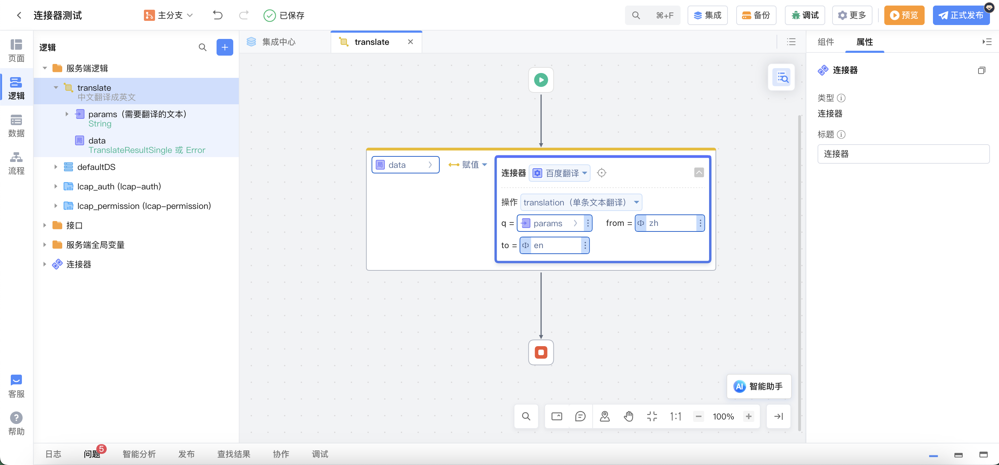
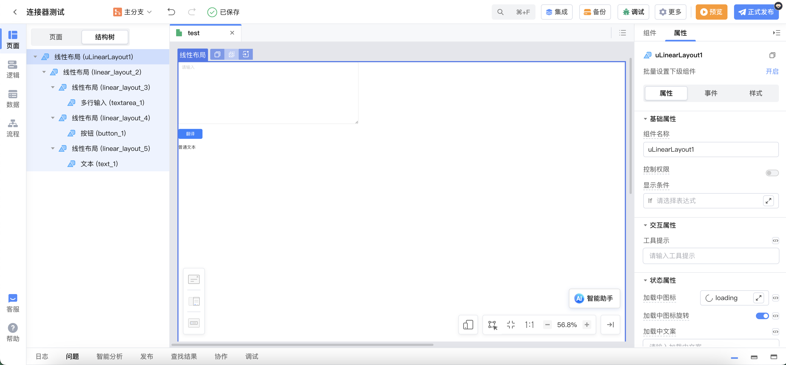
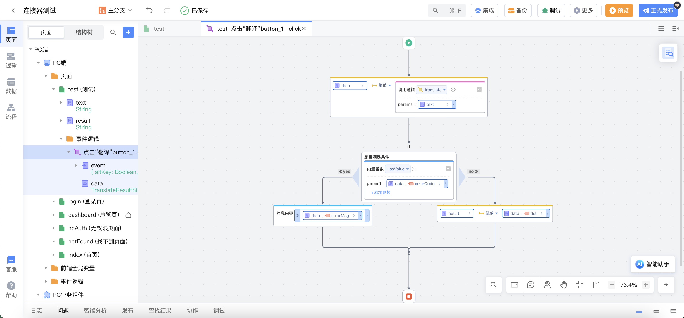

# 百度翻译连接器

## 功能概述

百度翻译 API 支持提供 200+语种互译的在线文本翻译服务，支持多达 4 万多个语言方向，且支持多语种自动检测。您只需调用通用翻译 API，传入待翻译的内容，并指定要翻译的源语言（支持源语言语种自动检测）和目标语言，即可得到相应的翻译结果。任何第三方应用或网站都可以通过使用通用翻译 API 为用户提供实时优质的多语言翻译服务，提升产品体验。百度翻译连接器用于调用百度翻译 API。

调用百度翻译 API，需要接入百度翻译服务，请参考：[百度翻译-接入服务](https://fanyi-api.baidu.com/doc/13)

## 功能介绍

用于将给定的文本，从源语言翻译为目标语言。支持单条和批量文本翻译。

| 操作标识         | 操作名称     | 对应百度翻译接口文档               |
| ---------------- | ------------ | ---------------------------------- |
| translation      | 单条文本翻译 | https://fanyi-api.baidu.com/doc/21 |
| translationBatch | 批量文本翻译 | https://fanyi-api.baidu.com/doc/21 |

### translation 标识说明

`translation 标识` 入参说明

| 参数名 | 类型   | 是否必填 | 描述           | 备注            |
| ------ | ------ | -------- | -------------- | --------------- |
| q      | String | 是       | 需要翻译的文本 | 单条文本翻译    |
| from   | String | 是       | 翻译源语言     | 可设置为 auto   |
| to     | String | 是       | 翻译目标语言   | 不可设置为 auto |

> 注意：请将单次翻译文本长度限定为 6000 字节以内（汉字约为 2000 个）。

`translation 标识` 出参说明

| 参数名    | 类型   | 描述     | 备注                                                           |
| --------- | ------ | -------- | -------------------------------------------------------------- |
| from      | String | 源语言   | 返回用户指定的语言，或者自动检测出的语种（源语言设为 auto 时） |
| to        | String | 目标语言 | 返回用户指定的目标语言                                         |
| src       | String | 原文     | 需要翻译的文本                                                 |
| dst       | String | 译文     | 翻译结果                                                       |
| errorCode | String | 错误码   | 仅当存在错误时有值                                             |
| errorMsg  | String | 错误信息 | 仅当存在错误时有值                                             |

### translationBatch 标识说明

`translationBatch 标识` 入参说明

| 参数名 | 类型         | 是否必填 | 描述               | 备注            |
| ------ | ------------ | -------- | ------------------ | --------------- |
| q      | List<String> | 是       | 需要翻译的文本列表 | 批量文本翻译    |
| from   | String       | 是       | 翻译源语言         | 可设置为 auto   |
| to     | String       | 是       | 翻译目标语言       | 不可设置为 auto |

> 注意：请将批量翻译数量控制在 4000 个以内，总文本长度限定为 6000 字节以内（汉字约为 2000 个）。

`translationBatch 标识` 出参说明

| 参数名      | 类型            | 描述     | 备注                                                           |
| ----------- | --------------- | -------- | -------------------------------------------------------------- |
| from        | String          | 源语言   | 返回用户指定的语言，或者自动检测出的语种（源语言设为 auto 时） |
| to          | String          | 目标语言 | 返回用户指定的目标语言                                         |
| transResult | List<Translate> | 翻译结果 | 返回翻译结果，包括 `src` 和 `dst` 字段                         |
| errorCode   | String          | 错误码   | 仅当存在错误时有值                                             |
| errorMsg    | String          | 错误信息 | 仅当存在错误时有值                                             |

`Translate`结构说明

| 字段名 | 类型   | 说明 |
| ------ | ------ | ---- |
| src    | String | 原文 |
| dst    | String | 译文 |

## 操作示例

### 1. 添加连接器

添加连接器并填入`appid`（应用 ID）和`secretKey`（密钥）。

**注意**：当进行**连通性测试**时，开发环境和生产环境使用相同的配置，只要有一个连通成功即可。出现一个连接失败的情况，这是由于百度翻译对于标准版服务，QPS（每秒请求量）=1，如需更大频率，需先进行身份认证，认证通过后可切换为高级版（适用于个人，QPS=10）或尊享版（适用于企业，QPS=100）

### 2. 调用连接器

示例：使用百度翻译连接器将中文翻译成英文。

创建服务端逻辑，添加输入参数`params`，类型为`String`，代表需要翻译的文本，调用百度翻译连接器，操作选择`translation`(单条文本翻译)，`from参数`输入文本`zh`，`to参数`输入文本`en`，创建局部变量`data`接收连接器调用结果。

添加输出参数`result`，对接收的结果`data`进行匹配，当结果正确返回时，将`data`赋值给`result`；当结果返回`Error`时，输出日志。

创建页面如下图所示，使用`多行输入组件`接收用户输入的需要翻译的文本，使用`文本组件`展示翻译结果。

在页面创建`text局部变量`用于绑定多行输入组件的值，创建`result局部变量`用于绑定翻译结果。

翻译按钮添加事件逻辑，调用之前创建的服务端逻辑。对调用返回结果进行判断，当结果中存在错误码时，弹出消息；当调用结果中不存在错误码时，将翻译结果赋值给`result局部变量`。

预览应用，输入需要翻译的文本，点击翻译，即可差看到翻译结果。

## 支持语种列表

常见语种列表

| 名称         | 代码 | 名称       | 代码 | 名称       | 代码 |
| ------------ | ---- | ---------- | ---- | ---------- | ---- |
| 自动检测     | auto | 中文       | zh   | 英语       | en   |
| 粤语         | yue  | 文言文     | wyw  | 日语       | jp   |
| 韩语         | kor  | 法语       | fra  | 西班牙语   | spa  |
| 泰语         | th   | 阿拉伯语   | ara  | 俄语       | ru   |
| 葡萄牙语     | pt   | 德语       | de   | 意大利语   | it   |
| 希腊语       | el   | 荷兰语     | nl   | 波兰语     | pl   |
| 保加利亚语   | bul  | 爱沙尼亚语 | est  | 丹麦语     | dan  |
| 芬兰语       | fin  | 捷克语     | cs   | 罗马尼亚语 | rom  |
| 斯洛文尼亚语 | slo  | 瑞典语     | swe  | 匈牙利语   | hu   |
| 繁体中文     | cht  | 越南语     | vie  |

更多百度翻译支持语种列表请参考[通用文本翻译-语种列表](https://fanyi-api.baidu.com/doc/21)
